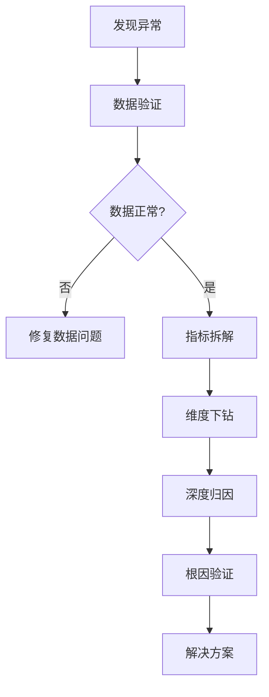

# AI问题分析框架

## 框架概览

这是一套完整的AI驱动的数据异常分析框架，基于专业的四步分析法，帮助快速定位和解决各类业务指标异常问题。

## 文件结构

```
ai-problem-analysis/
├── README.md                           # 框架说明（本文件）
├── problem-analysis-framework.md       # 核心分析方法论
├── generic-metric-analysis-template.md # 通用指标分析模板
├── core-metrics-analysis-templates.md  # 核心指标专用模板
├── dau-analysis-template.md            # DAU分析四步法示例
├── automated-analysis-queries.md       # 自动化监控查询
└── root-cause-playbook.md             # 根因分析手册
```

## 四步分析法

### 🔍 第一步：数据验证
- **目标**: 排除数据问题导致的"假异常"
- **内容**: 数据完整性、计算口径、处理流程验证
- **时间**: 5-10分钟快速验证

### 📊 第二步：指标拆解
- **目标**: 识别问题的具体来源
- **方法**: 加法拆解、乘法拆解、漏斗拆解
- **重点**: 定位异常来自哪个组成部分

### 🎯 第三步：维度下钻
- **目标**: 精确定位问题发生的具体场景
- **维度**: 用户、时间、渠道、产品、地域等
- **深度**: 从大方向聚焦到具体场景

### 🔎 第四步：深度归因
- **目标**: 找到导致问题的根本原因
- **方法**: 相关性分析、时序分析、对照验证
- **输出**: 可信的根因结论和解决方案

## 快速开始

### 1. 选择合适的模板

#### 按问题类型选择：
- **DAU下降** → `dau-analysis-template.md`
- **收入异常** → `core-metrics-analysis-templates.md` (商业化部分)
- **用户质量问题** → `core-metrics-analysis-templates.md` (质量部分)
- **其他指标** → `generic-metric-analysis-template.md`

#### 按分析深度选择：
- **快速检查** → `automated-analysis-queries.md`
- **深度分析** → 相应的专用模板
- **根因分析** → `root-cause-playbook.md`

### 2. 执行分析流程



### 3. 参数替换

执行模板前，需要替换以下参数：
- `[数据表名]` → 实际表名
- `[字段名]` → 实际字段名  
- `[时间范围]` → 分析时间范围
- `[过滤条件]` → 业务过滤条件
- `[目标值]` → 业务目标阈值

## 支持的分析场景

### 用户增长类
- ✅ DAU/MAU异常
- ✅ 新增用户波动
- ✅ 留存率下降
- ✅ 活跃度变化

### 商业化类  
- ✅ 收入异常
- ✅ ARPU波动
- ✅ 付费转化问题
- ✅ ARPPU变化

### 用户质量类
- ✅ Good率异常
- ✅ 认证率变化
- ✅ 用户画像偏移
- ✅ 质量指标下降

### 运营效率类
- ✅ CPA异常
- ✅ 渠道效果问题
- ✅ ROI下降
- ✅ 转化率异常

### 产品功能类
- ✅ 功能使用率
- ✅ 用户行为变化
- ✅ 产品体验问题
- ✅ 功能效果评估

## 自动化能力级别

### L1 - 基础监控
- 异常检测预警
- 基础指标计算
- 简单趋势分析

### L2 - 智能分析
- 多维度拆解
- 异常来源定位
- 模板化分析

### L3 - 根因诊断
- 关联性分析
- 业务场景结合
- 假设验证推理

### L4 - 决策支持
- 趋势预测
- 影响评估
- 解决方案建议

## 最佳实践

### 分析原则
1. **数据优先**: 每个结论都要有数据支撑
2. **多维验证**: 从多个角度验证分析结果
3. **业务结合**: 结合业务场景解读数据
4. **迭代优化**: 根据验证结果调整分析方向

### 使用技巧
1. **并行分析**: 同时从多个维度切入分析
2. **递进深入**: 从宏观到微观，逐步聚焦
3. **假设驱动**: 基于假设设计验证实验
4. **文档记录**: 记录分析过程，形成知识库

### 常见陷阱
- ❌ 把相关性当因果性
- ❌ 单一维度得出结论
- ❌ 忽略样本量要求
- ❌ 过度拟合异常现象

## 业务规则集成

框架已深度集成 `user-rules.md` 中的业务规则：
- ✅ 用户质量定义 (good用户、认证用户)
- ✅ ARPU计算规则 (基于优质用户)
- ✅ CPA计算规则 (获取优质用户成本)
- ✅ 画像指标基准 (基于good且认证用户)
- ✅ 数据质量控制 (is_test过滤、分区要求)

## 扩展指南

### 添加新指标模板
1. 分析指标特性（加法型/乘法型/漏斗型）
2. 选择合适的拆解方法
3. 定义关键维度和验证逻辑
4. 参考现有模板创建新模板

### 定制化修改
1. 调整业务规则定义
2. 修改阈值和预警标准  
3. 增加特定维度分析
4. 优化SQL查询性能

## 联系支持

遇到问题或需要扩展功能，请：
1. 查看 `root-cause-playbook.md` 寻找解决方案
2. 参考 `problem-analysis-framework.md` 了解原理
3. 使用 `generic-metric-analysis-template.md` 自定义分析

---
*框架版本: v1.0*  
*最后更新: 2025-08-06*  
*维护团队: AI分析框架组*